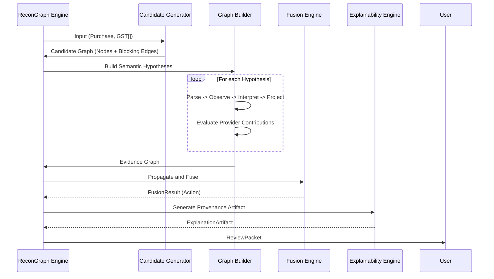
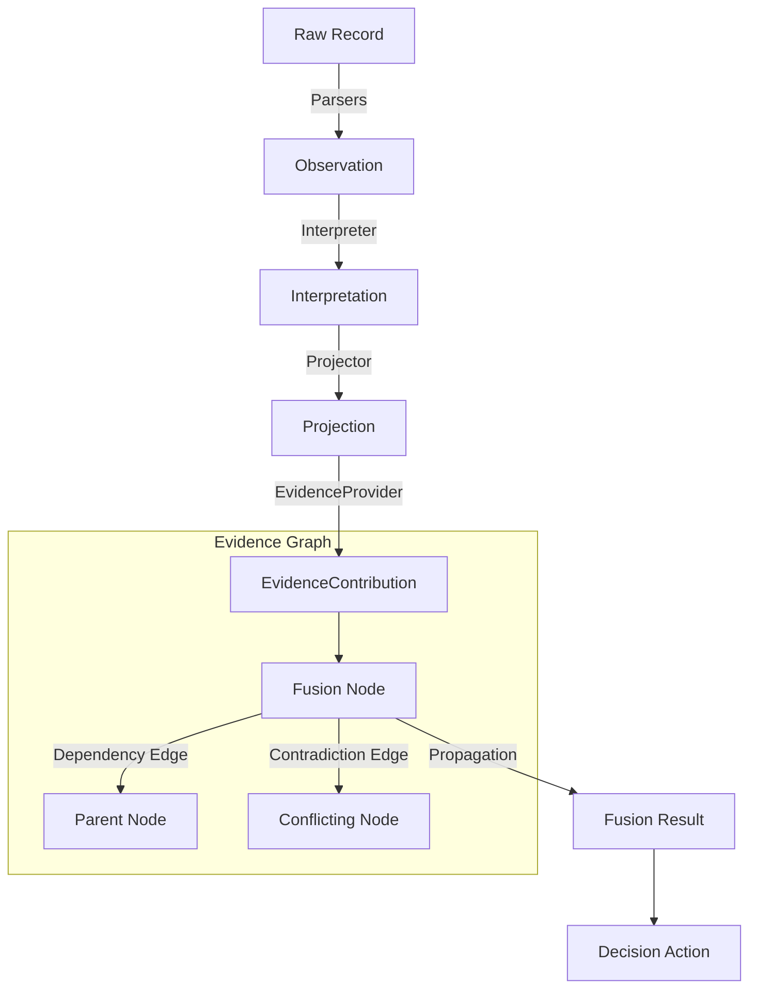
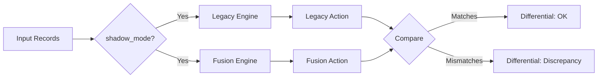
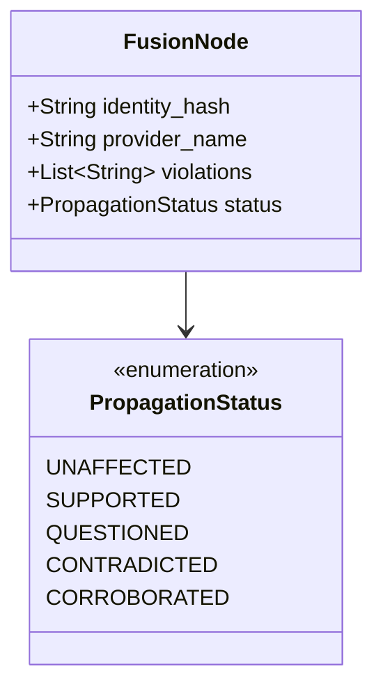

# ReconGraph Architecture

ReconGraph is a pipeline of semantic transformation. Data moves from unstructured, disconnected records into a unified graph of evidence.

## System Flow

The core of ReconGraph executes in these distinct phases:

## Data Lifecycle

ReconGraph's epistemic guarantee comes from its strict data lifecycle. Data is transformed immutably at each step:

## Differential Shadow Mode Architecture

To support safe deployments, ReconGraph can run Legacy Heuristics and Graph Fusion side-by-side, producing differential reports.

## Evidence Node Taxonomy

A `FusionNode` encapsulates an `EvidenceContribution`. It carries explicit state regarding its role in the graph.

