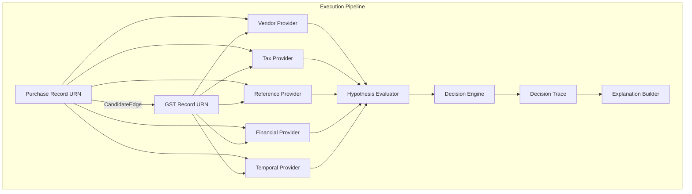

# ReconGraph V2 Architecture

## Status
**FROZEN (Stage 8C-T6)** - The Execution Architecture and Domain Pipelines are finalized. No further changes to execution contracts are permitted without explicit architectural re-evaluation.

## 1. The Execution Lifecycle

ReconGraph strictly enforces a 4-phase execution lifecycle. Every domain of evidence (Vendor, Tax, Financial, Reference, Temporal) MUST implement these four phases in strict isolation.

### Phase 1: Deterministic Extraction
- **Role:** Safely transition raw strings into strongly typed `Observation` artifacts.
- **Contract:** Parsers (`VendorParser`, `TaxIdentifierParser`, etc.) are the **exclusive** authorities on string manipulation.
- **Output:** Immutable `Observation` or `Artifact`.

### Phase 2: Structural Interpretation
- **Role:** Describe the epistemological relationship between two sets of observations.
- **Contract:** Interpreters (`TaxPairInterpreter`, `VendorPairInterpreter`) NEVER evaluate legal or business validity. They simply describe the structural geometry of the data (e.g. `EXACT_MATCH`, `DISTINCT`, `ONE_MISSING`).
- **Output:** Domain-specific `Interpretation` (e.g. `GSTINRelationState`).

### Phase 3: Semantic Projection
- **Role:** Translate the structural interpretation into a mathematical `EvidenceContribution` based on a configurable `Policy`.
- **Contract:** Projectors inject scalar scores, penalties, and explicit string-based `violation` tags into the domain pipeline.
- **Output:** `EvidenceContributionV2`.

### Phase 4: Aggregation and Evaluation
- **Role:** Aggregate evidence across all domains into a final verdict.
- **Contract:** 
  1. The `EvidenceProvider` blindly orchestrates Phases 1-3.
  2. The `ReconGraphEngine` loops over all `EvidenceProviders` without order dependency.
  3. The `HypothesisEvaluator` consumes the aggregated evidence and calculates final `SemanticFindings` and `EligibilityStatus`.

## 2. Dependency Graph (Strict Bipartite Model)

The graph building phase uses `CandidateGraphBuilder` to enforce bipartite topology.

## 3. Order Independence Contract
The execution order of `EvidenceProviders` is mathematically proven to have **no effect** on the final `DecisionTrace`. The Trace's SHA-256 identity will always match identically regardless of provider sequence.

## 4. Evidence Fusion Architecture (Stage 8I)
ReconGraph V2 employs a topological Constraint Satisfaction Graph to aggregate evidence, preventing double-counting and handling contradictions deterministically.
For deep-dives into the mathematical foundations, see:
- [Evidence Fusion Ontology](./evidence-fusion.md)
- [Evidence Dependency Model](./evidence-dependency-model.md)
- [Contradiction Algebra](./contradiction-algebra.md)
- [Missingness Algebra](./missingness-model.md)
- [Fusion Design Report](./fusion-design-report.md)

## 5. Source of Truth
See the [ADR Index](./adr/index.md) for detailed architectural decisions governing this pipeline.
