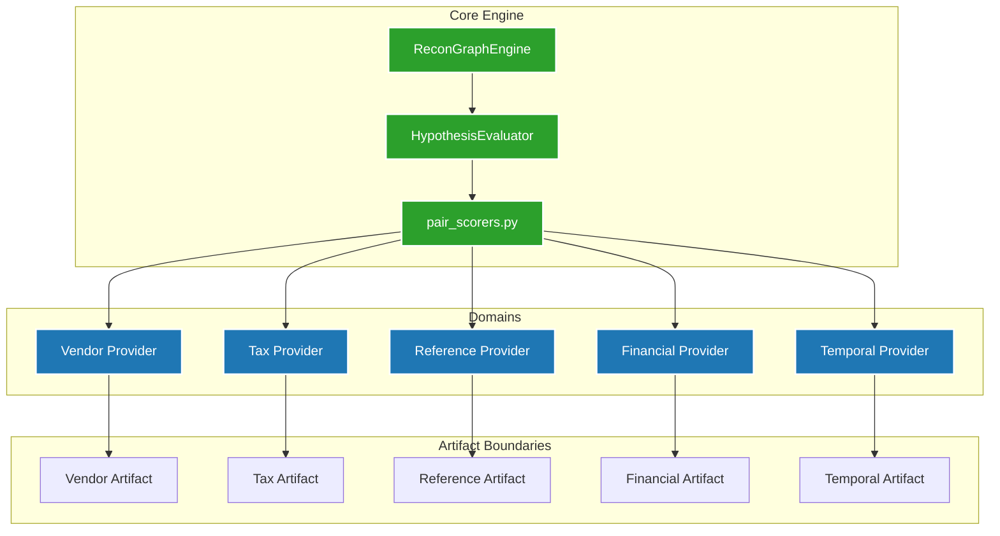

# Dependency Graph

## Anti-Dependencies (Strictly Forbidden)
- PairScorers MUST NOT depend on `signals.py`.
- Evaluators MUST NOT depend on Domain Parsers.
- Domains MUST NOT depend on `DecisionEngine` policies.
