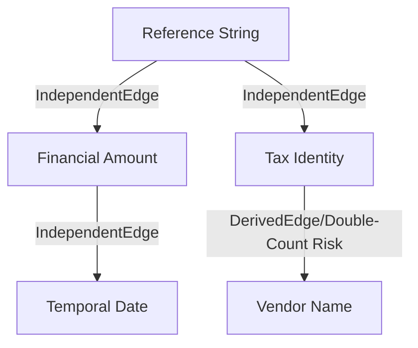

# Evidence Dependency Model (Stage 8I)

This document maps the ontological independence and dependence of evidence pipelines in ReconGraph V2. It prevents double-counting by ensuring derived evidence is not treated as independent corroboration.

## Phase 3: Independence & Dependence Model

Evidence in ReconGraph is not always independent. Failing to recognize dependence leads to synthetic certainty (double-counting).

### Edge Definitions

- `IndependentEdge`: Two evidence sources that are causally and logically distinct. (e.g., Financial Amount and Tax Identity).
- `DerivedEdge`: One evidence source is a strict subset or transformation of another. (e.g., A Vendor Name extracted from a PAN is derived from the Tax Identity).
- `DuplicateEdge`: Two evidence sources represent the exact same phenomenon extracted twice.
- `CorrelatedEdge`: Two evidence sources are statistically related but causally distinct. (e.g., Date and Invoice Number often co-occur in the same system).

### The Evidence Dependency Graph

#### 1. Tax & Vendor Independence
**Scenario:**
- System A provides `GSTIN: 07CLOUD123`
- System B provides `Vendor Name: CloudLedger`

**Dependency Type:** `DerivedEdge / DuplicateEdge Risk`
**Reasoning:** If the parsing of the GSTIN in System A implies "CloudLedger", evaluating the Vendor Name similarity as an *independent* variable double-counts the identity match. Tax pipelines and Vendor pipelines are highly correlated.

#### 2. Financial & Temporal Independence
**Scenario:**
- `Amount: 25000.0`
- `Date: 2026-06-05`

**Dependency Type:** `IndependentEdge`
**Reasoning:** The amount of an invoice and the date of an invoice are orthogonal dimensions of reality. A match on both provides genuine, independent corroboration.

#### 3. Reference & Vendor
**Dependency Type:** `IndependentEdge`
**Reasoning:** An invoice reference (e.g., `INV-1042`) is generated by a billing system. The Vendor Name represents the legal entity. They are independent.

### Model Formalization

### Double Counting Prevention Rule

If `A` and `B` share a `DerivedEdge` or `CorrelatedEdge`, the Fusion engine MUST apply a **Sub-additivity penalty**. 
`Support(A ∪ B) < Support(A) + Support(B)`

If `A` and `B` are strictly `Independent`, the Fusion engine MAY apply **Additivity**.
`Support(A ∪ B) = Support(A) + Support(B)`
