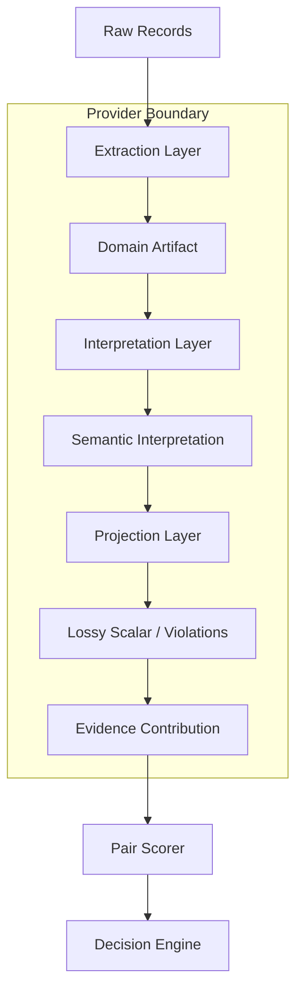

# Execution Model

This document outlines the strict execution pipeline for ReconGraph Domain Evidencing.

## The Canonical Lifecycle

All data in ReconGraph must flow through a deterministic pipeline that isolates string manipulation, semantic judgment, and scalar scoring. The pipeline enforces a unidirectional flow of data:

## Layers of the Pipeline

1. **Extraction (Parsers)**: The only layer permitted to use Regex, string splitting, text normalization, or token counting. Extracts an immutable `DomainArtifact`.
2. **Interpretation (Interpreters)**: The only layer permitted to derive relationships. Takes two `DomainArtifacts` and emits a formal `DomainPairInterpretation` describing semantic states (e.g. `EXACT_MATCH`, `DISTINCT`, `DIFFERENT_STATE_SAME_PAN`). Must never manipulate strings.
3. **Projection (Contracts)**: The only layer permitted to lossily compress a semantic interpretation into a `float` scalar. Acts as the compatibility layer for the legacy Decision Engine. Emits `DomainV1ScalarProjection`.
4. **Contribution**: Packages the projection into an `EvidenceContributionV2` and delivers it to the Pair Scorer.
5. **Pair Scorer**: Aggregates all contributions across domains. Must NEVER execute pipeline logic itself. Must NEVER derive Eligibility or Semantic Findings.
6. **Decision Engine (Evaluator)**: Analyzes the aggregated contributions, extracts `violations`, and determines global `Eligibility` and `RelationshipScore`.
